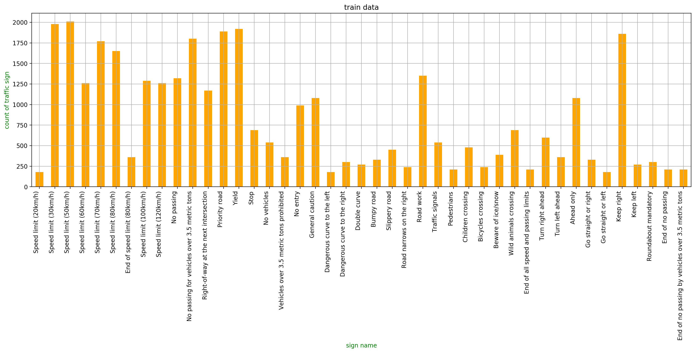
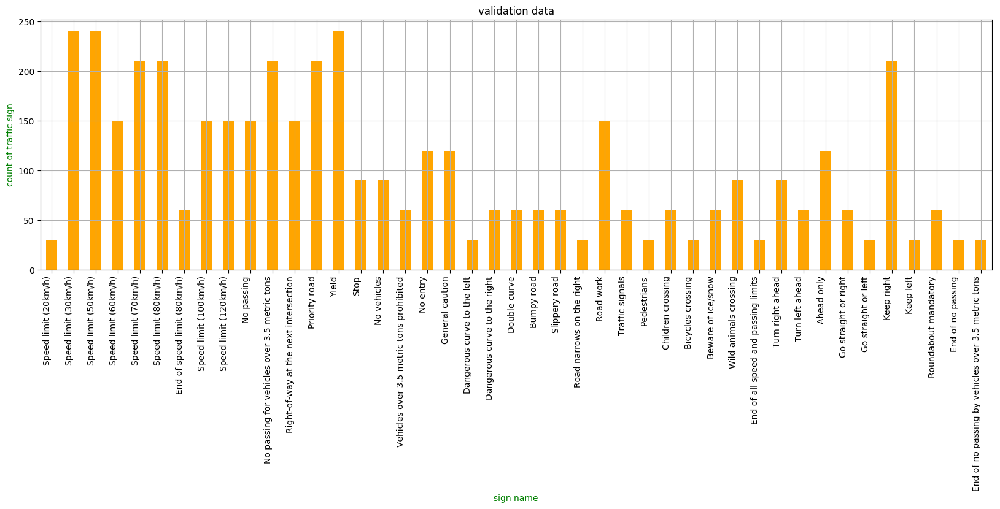
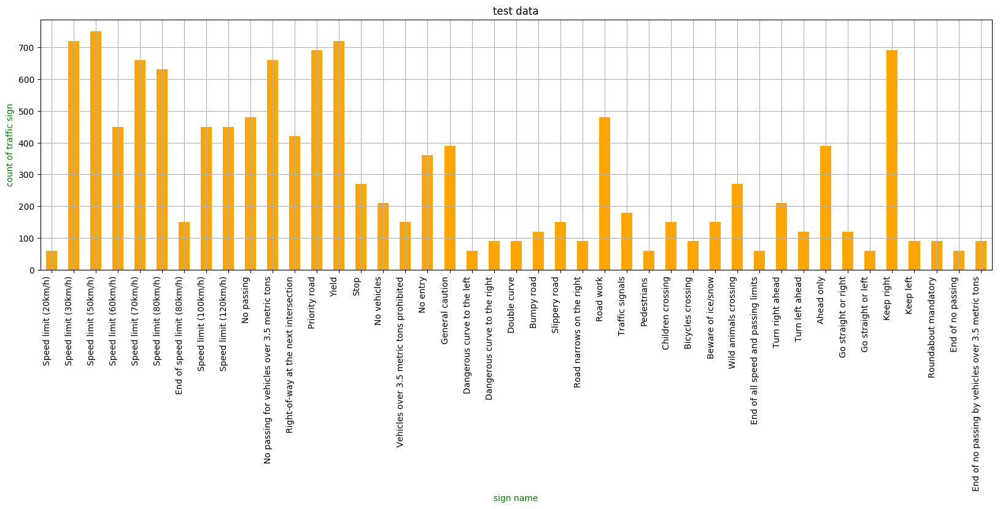
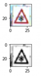
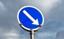
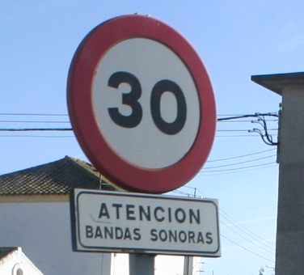
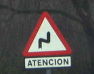
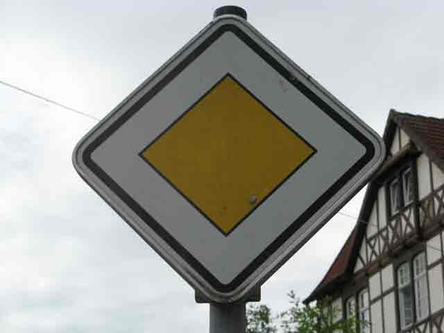
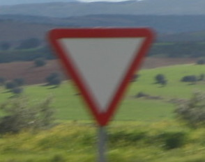

# **Traffic Sign Recognition**

## Writeup Template

### You can use this file as a template for your writeup if you want to submit it as a markdown file, but feel free to use some other method and submit a pdf if you prefer.

---

**Build a Traffic Sign Recognition Project**

The goals / steps of this project are the following:
* Load the data set (see below for links to the project data set)
* Explore, summarize and visualize the data set
* Design, train and test a model architecture
* Use the model to make predictions on new images
* Analyze the softmax probabilities of the new images
* Summarize the results with a written report

[//]: # (Image References)

[image1]: ./examples/visualization.jpg "Visualization"
[image2]: ./examples/grayscale.jpg "Grayscaling"
[image3]: ./examples/random_noise.jpg "Random Noise"
[image4]: ./examples/placeholder.png "Traffic Sign 1"
[image5]: ./examples/placeholder.png "Traffic Sign 2"
[image6]: ./examples/placeholder.png "Traffic Sign 3"
[image7]: ./examples/placeholder.png "Traffic Sign 4"
[image8]: ./examples/placeholder.png "Traffic Sign 5"

## Rubric Points
### Here I will consider the [rubric points](https://review.udacity.com/#!/rubrics/481/view) individually and describe how I addressed each point in my implementation.  

---
### Writeup / README

#### 1. Provide a Writeup / README that includes all the rubric points and how you addressed each one. You can submit your writeup as markdown or pdf. You can use this template as a guide for writing the report. The submission includes the project code.

You're reading it! and here is a link to my [project code](https://github.com/udacity/CarND-Traffic-Sign-Classifier-Project/blob/master/Traffic_Sign_Classifier.ipynb)

### Data Set Summary & Exploration

#### 1. Provide a basic summary of the data set and identify where in your code the summary was done. In the code, the analysis should be done using python, numpy and/or pandas methods rather than hardcoding results manually.

The code for this step is contained in the second code cell of the IPython notebook.  

I used the pandas library to calculate summary statistics of the traffic
signs data set:

* The size of training set is 34799
* The size of test set is 12630
* The shape of a traffic sign image is (32, 32, 3)
* The number of unique classes/labels in the data set is 43

#### 2. Include an exploratory visualization of the dataset and identify where the code is in your code file.

The code for this step is contained in the third code cell of the IPython notebook.  

Here is an exploratory visualization of the data set. It is a bar chart showing how each count of traffic sign in the train data.

And below is the chart of validation data.

And below is the cart of test data.

It seems that the count of data is lopsided. So I think the trained model will have less accuracy at the traffic sign of less count than the traffic sign of large count.

### Design and Test a Model Architecture

#### 1. Describe how, and identify where in your code, you preprocessed the image data. What tecniques were chosen and why did you choose these techniques? Consider including images showing the output of each preprocessing technique. Pre-processing refers to techniques such as converting to grayscale, normalization, etc.

The code for this step is contained in the fourth code cell of the IPython notebook.

As a first step, I decided to convert the images to grayscale because grayscale image is easier to find the characteristics so using gray scale give lots more accuracy while training.

Here is an example of a traffic sign image before and after grayscaling.

As a last step, I normalized the image data because neural network work much better with smaller value.

#### 2. Describe, and identify where in your code, what your final model architecture looks like including model type, layers, layer sizes, connectivity, etc.) Consider including a diagram and/or table describing the final model.

The code for my final model is located in the fifth cell of the ipython notebook.

My final model consisted of the following layers:

| Layer         		|     Description	        					|
|:---------------------:|:---------------------------------------------:|
| Input         		| 32x32x1 gray scale image   							|
| Convolution 5x5     	| 1x1 stride, valid padding, outputs 28x28x6 	|
| RELU					|												|
| Max pooling	      	| 2x2 stride,  outputs 14x14x6 				|
| Convolution 5x5	    | 1x1 stride, valid padding, outputs 10x10x16      									|
| RELU					|												|
| Max pooling	      	| 2x2 stride,  outputs 5x5x16 				|
| Fully connected		| input 400, outputs 120        									|
| RELU					|												|
| Dropout					|		0.5 keep prob										|
| Fully connected		| input 120, outputs 84        									|
| RELU					|												|
| Dropout					|		0.5 keep prob										|
| Fully connected		| input 84, outputs 43        									|

#### 3. Describe how, and identify where in your code, you trained your model. The discussion can include the type of optimizer, the batch size, number of epochs and any hyperparameters such as learning rate.

The code for training the model is located in the seventh cell of the ipython notebook.

To train the model, I used an AdamOptimizer.

#### 4. Describe the approach taken for finding a solution. Include in the discussion the results on the training, validation and test sets and where in the code these were calculated. Your approach may have been an iterative process, in which case, outline the steps you took to get to the final solution and why you chose those steps. Perhaps your solution involved an already well known implementation or architecture. In this case, discuss why you think the architecture is suitable for the current problem.

The code for calculating the accuracy of the model is located in the nineth cell of the Ipython notebook.

My final model results were:
* training set accuracy of 0.998
* validation set accuracy of 0.949
* test set accuracy of 0.922

If an iterative approach was chosen:
* What was the first architecture that was tried and why was it chosen?  

I choose Lenet architecture, because this architecture is expected to perform well.

* What were some problems with the initial architecture?  

When the first time I try this, this model overfit with the training set.

* How was the architecture adjusted and why was it adjusted? Typical adjustments could include choosing a different model architecture, adding or taking away layers (pooling, dropout, convolution, etc), using an activation function or changing the activation function. One common justification for adjusting an architecture would be due to over fitting or under fitting. A high accuracy on the training set but low accuracy on the validation set indicates over fitting; a low accuracy on both sets indicates under fitting.  

I want to prevent overfitting, so I add dropout after layer3 and layer4.  
  After this, the model's accuracy of validation data set and test set increases.

* Which parameters were tuned? How were they adjusted and why?  

batch size is 1000. and EPOCH is 100.

* What are some of the important design choices and why were they chosen? For example, why might a convolution layer work well with this problem? How might a dropout layer help with creating a successful model?  

日本語で失礼します。
Convolution layer は繰り返し用いることで、画像の共通の部品を抽出しながら、それらから構成される特徴画像を抽出していき、低レベルな画像から最終的にはそれらを組み合わせて、高レベルな標識の画像を抽出することができます。
よって、traffic sign classification には Convolution layer が有効に働きます。
また、dropout を導入することで、training set への過学習を防ぐことができます。これにより他のデータでも classification の確率を高めることができます。

### Test a Model on New Images

#### 1. Choose five German traffic signs found on the web and provide them in the report. For each image, discuss what quality or qualities might be difficult to classify.

Here are five German traffic signs that I found on the web:

 
 
 

I think that the double curve image might be difficult to classify because the count of this image in the data set is less than the others, so this image can't be classified correctly.

#### 2. Discuss the model's predictions on these new traffic signs and compare the results to predicting on the test set. Identify where in your code predictions were made. At a minimum, discuss what the predictions were, the accuracy on these new predictions, and compare the accuracy to the accuracy on the test set (OPTIONAL: Discuss the results in more detail as described in the "Stand Out Suggestions" part of the rubric).

The code for making predictions on my final model is located in the 14th cell of the Ipython notebook.

Here are the results of the prediction:

| Image			        |     Prediction	        					|
|:---------------------:|:---------------------------------------------:|
| Keep right      		| Road work   									|
| Speed limit (30km/h)     			| Roundabout mandatory 										|
| Double curve					| Dangerous curve to the right											|
| Priority road	      		| Priority road Road					 				|
| Yield			| Yield      							|

The model was able to correctly guess 2 of the 5 traffic signs, which gives an accuracy of 40%. This accuracy is too less than the accuracy of test set.
I think that the cause of less accuracy is complexity of each image.
Yield and Priority road image is less complex than others. So the prediction of yield and priority is correct and others become wrong.
By shrinking the size, the image become unclear.

#### 3. Describe how certain the model is when predicting on each of the five new images by looking at the softmax probabilities for each prediction and identify where in your code softmax probabilities were outputted. Provide the top 5 softmax probabilities for each image along with the sign type of each probability. (OPTIONAL: as described in the "Stand Out Suggestions" part of the rubric, visualizations can also be provided such as bar charts)

The code for making predictions on my final model is located in the 16th cell of the Ipython notebook.

日本語で失礼します。
最初の画像では99.5%の確率で Road work と判定されています。こちらの画像は Keep right の標識ですので、完全に誤っています。縮小した際に画像が不鮮明になったことが原因かと思われます。
top five の soft max probability は以下です。

| Probability         	|     Prediction	        					|
|:---------------------:|:---------------------------------------------:|
| .95         			| Road work   									|
| .0.04     				|  Keep right 										|
| .0000000002					| 	Dangerous curve to the right										|
| .00000000001	      			| Beware of ice/snow					 				|
| .0000000000005				    | Yield     							|

２番目の画像では 67% の確率で Roundabout mandatory と判定されていますが、Speed limit (30km/h) の画像ですので、これも誤りです。１番目の場合と同じことが原因と思われます。
top five の soft max probability は以下です。

| Probability         	|     Prediction	        					|
|:---------------------:|:---------------------------------------------:|
| .67         			| Roundabout mandatory   									|
| .13     				|  Keep right right 										|
| .10					| 	Priority right										|
| .04	      			| Speed limit (30km/h)					 				|
| .01				    | No vehicles     							|

3番目の画像では 99% の確率で Dangerous curve to the right と判定されていますが、Speed limit (30km/h) の画像ですので、これも誤りです。１番目の場合と同じことが原因と思われます。
top five の soft max probability は以下です。

| Probability         	|     Prediction	        					|
|:---------------------:|:---------------------------------------------:|
| .99         			| Dangerous curve to the right   									|
| .00000001     				|  Pedestrians right 										|
| .00000001					| 	Slipy road										|
| .00000001	      			| Children crossing					 				|
| .00000001				    |  Dangerous curve to the right    							|

4番目の画像では 100% の確率で Priority road と正しく判定されました。単純な図形なので、縮小されて不鮮明になっても正しく判定されたのかと思われます。
top five の soft max probability は以下です。
  
| Probability         	|     Prediction	        					|
|:---------------------:|:---------------------------------------------:|
| 1.00         			| Priority road   									|
| about 0.0     				|  Roundabout mandatory 										|
| about 0.0					| 	Keep right										|
| about 0.0	       			| General caution					 				|
| about 0.0				    |  No vehicles   							|

5番目の画像では 100% の確率で Yield と正しく判定されました。やはりこれも単純な図形なので、縮小されて不鮮明になっても正しく判定されたのかと思われます。
top five の soft max probability は以下です。 
  
| Probability         	|     Prediction	        					|
|:---------------------:|:---------------------------------------------:|
| 1.00         			|  Yield   									|
| about 0.0     				|  Ahead only 										|
| about 0.0					| 	Road work										|
| about 0.0	       			| Priority road					 				|
| about 0.0				    |  No vehicles   							|
